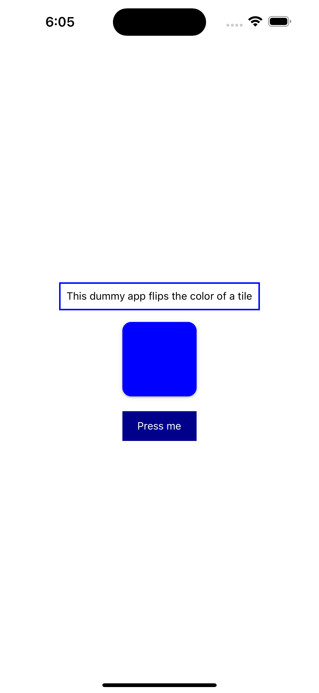
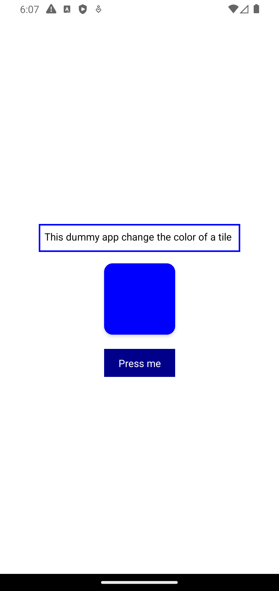

# Introduction to styling in React Native

This is a dummy application that touches a series of knowledge points in mobile development using React Native:

* How to center something on a mobile screen
* Safe areas on a mobile screen
* Reconcile style differences of buttons on different platforms
* Inline styles
* React hook `useState`

This application will render to iOS as follows:

This application will render to Android as follows:

This appliation is a teaching and learning demo developed by [Qiang Hao](https://qhao.info/) for CSCI 412 Mobile Development at Western Washington University.

